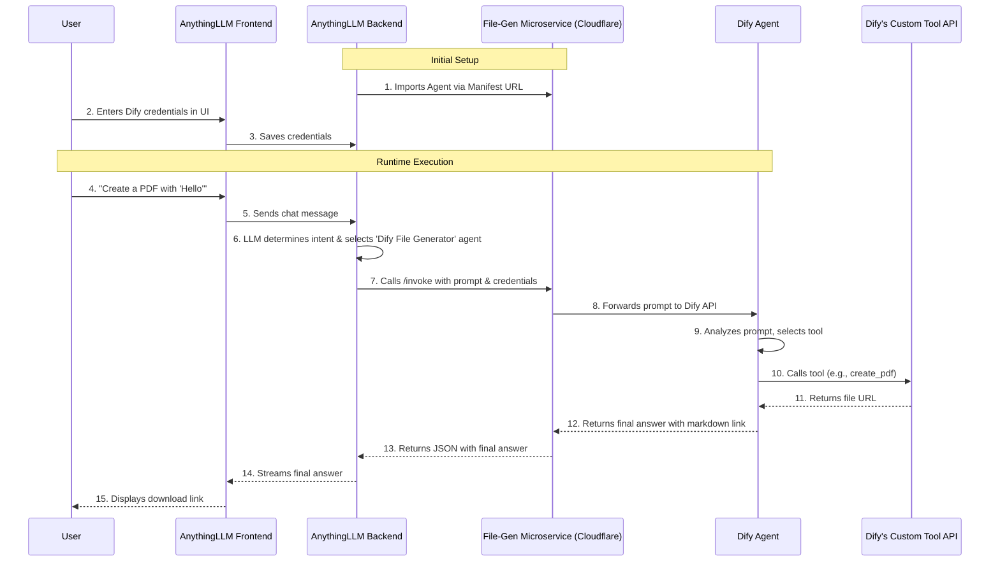

# System Architecture: Dify File Generation Agent for AnythingLLM

This document outlines the architecture for integrating a custom file-generation agent, built on the Dify platform, with AnythingLLM. The design prioritizes minimal changes to the core AnythingLLM codebase by leveraging its built-in **Custom Agent** functionality.

## Core Components

1.  **AnythingLLM**: The primary user-facing application. Users interact with it to chat and request file generation.
2.  **Dify File-Generation Agent**: A specialized agent built on the Dify platform. It is designed to understand file creation requests and use custom tools to fulfill them.
3.  **File-Generation Microservice (Bridge)**: A feature-rich, lightweight Python (Flask) web service that acts as a bridge between AnythingLLM and Dify. It:
    *   Generates multiple file types, including PDF, DOCX, and XLSX, from provided content.
    *   Exposes an `anythingllm-manifest.json` file, allowing it to be discovered and configured as a custom agent within AnythingLLM.
    *   Provides an `/invoke` endpoint that AnythingLLM calls. This endpoint intelligently processes the conversation history, forwarding the user's prompt, the full chat history, and the last assistant response to the Dify agent.
4.  **Cloudflare**: The hosting platform for the File-Generation Microservice, providing a stable public URL required for the integration.

**Note on Project Structure**: The `File-Generation Microservice` is a completely standalone application and should be located **outside** of the AnythingLLM project directory to maintain a clean separation of concerns.

## Architecture Flow Diagram

## Step-by-Step Data Flow

1.  **Configuration**:
    *   The AnythingLLM admin imports the custom agent by providing the public URL of the bridge microservice's manifest (`.../anythingllm-manifest.json`).
    *   The admin then configures the agent in the AnythingLLM UI, providing the Dify API endpoint and secret key. These are stored securely by AnythingLLM.

2.  **User Request**:
    *   A user sends a message to an AnythingLLM workspace where the "Dify File Generator" agent is enabled (e.g., "Create a report about last quarter's sales and save it as a DOCX.").

3.  **Intent Recognition (AnythingLLM)**:
    *   AnythingLLM's core LLM processes the prompt.
    *   Based on the agent's description and examples (provided in the manifest), it determines that the "Dify File Generator" is the appropriate tool for this task.

4.  **Agent Invocation (AnythingLLM -> Bridge)**:
    *   AnythingLLM constructs a POST request to the bridge microservice's `/invoke` endpoint.
    *   The request body contains the user's full prompt and the Dify credentials that were saved during configuration.

5.  **Request Forwarding (Bridge -> Dify)**:
    *   The bridge microservice receives the request, extracts the prompt and credentials, and forwards the prompt to the configured Dify agent's `chat-messages` API.

6.  **Tool Execution (Dify)**:
    *   The Dify agent receives the prompt and the processed conversation context from the bridge.
    *   Its own LLM determines which internal tool to use (e.g., `create_docx`) based on a prioritized set of rules:
        1.  If the user asks to save the **last response**, the agent uses the isolated last message as the content.
        2.  If the user asks to save the **entire chat**, the agent uses the full, formatted conversation history as the content.
        3.  Otherwise, it uses the content provided directly in the prompt.
    *   It calls its custom tool API (which could be the same microservice or another one) to generate the file. The tool returns a public URL for the generated file.
    *   The Dify agent formats the response into a user-friendly message, such as: "I have created the document for you. You can download it [here](URL)."

7.  **Response Return**:
    *   Dify sends the final, formatted answer back to the bridge microservice.
    *   The bridge microservice wraps this answer in a JSON object (`{"text": "..."}`) and sends it back to AnythingLLM.
    *   AnythingLLM streams this final text response to the user, who sees the download link in the chat interface.

## Advantages of this Architecture

*   **Decoupled**: The core logic of AnythingLLM remains untouched. All custom logic is encapsulated within the Dify agent and the bridge microservice.
*   **Scalable**: New file types or more complex generation logic can be added by modifying the Dify agent and its tools, with no changes needed in AnythingLLM.
*   **Maintainable**: Updates to the file generation process are isolated from the main application.
*   **Secure**: API keys and other credentials are managed through AnythingLLM's standard configuration process.
